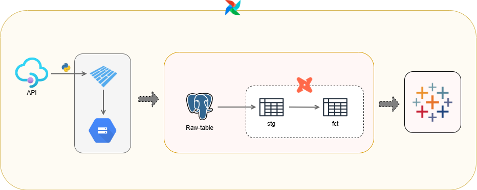

# Architecture


# ETL Movie Data Pipeline Using TMDB API

A comprehensive ETL (Extract, Transform, Load) pipeline that extracts movie data from The Movie Database (TMDB) API, orchestrates the workflow using Apache Airflow, and transforms the data using dbt (data build tool) for analytics purposes.

## 📋 Table of Contents

- [Overview](#overview)
- [Architecture](#architecture)
- [Technologies Used](#technologies-used)
- [Project Structure](#project-structure)
- [Data Flow](#data-flow)
- [Prerequisites](#prerequisites)
- [Setup and Installation](#setup-and-installation)
- [Usage](#usage)
- [Data Models](#data-models)

## 🎯 Overview

This project implements a complete data pipeline that:
- Extracts movie data, genre information, language details, country information, and production company data from TMDB API
- Loads raw data into PostgreSQL database
- Orchestrates the entire ETL workflow using Apache Airflow
- Transforms raw data into analytics-ready models using dbt
- Runs entirely in containerized Docker environment for easy deployment and scalability

## 🏗️ Architecture

```
TMDB API → Python Extractors → PostgreSQL (Raw) → dbt → PostgreSQL (Transformed) → Analytics
                    ↑
              Apache Airflow (Orchestration)
```


The pipeline consists of:
1. **Data Extraction Layer**: Custom Python scripts to fetch data from TMDB API
2. **Data Storage Layer**: PostgreSQL databases for raw and transformed data
3. **Orchestration Layer**: Apache Airflow for workflow management
4. **Transformation Layer**: dbt for data modeling and transformation

## 🛠️ Technologies Used

### Core Technologies
- **Python 3.x**: Primary programming language for data extraction
- **PostgreSQL 17**: Relational database for data storage
- **Apache Airflow 3.1.6**: Workflow orchestration and scheduling
- **dbt (data build tool)**: Data transformation framework
- **Docker & Docker Compose**: Containerization and orchestration

### Python Libraries
- `requests`: API communication
- `psycopg2`: PostgreSQL adapter
- `pandas`: Data manipulation (if applicable)

### Infrastructure
- **Docker Compose**: Multi-container orchestration
- **Docker Networks**: Container communication

## 📁 Project Structure

```
ETL_movie_data_using_tmdb_api/
│
├── airflow/
│   └── dags/
│       ├── movie_dag.py              # Original DAG with granular tasks
│       └── reconstruct_dag.py        # Simplified ETL pipeline DAG
│
├── ingest_api/
│   ├── main.py                       # Main extraction orchestration
│   ├── clients/
│   │   └── tmdb_client.py            # TMDB API client
│   ├── database/
│   │   ├── connection.py             # Database connection handler
│   │   └── repository/
│   │       ├── company_repository.py
│   │       ├── movie_repository.py
│   │       └── static_repository.py
│   └── extractor/
│       ├── company_extractor.py
│       ├── movie_extractor.py
│       └── static_extractor.py
│
├── dbt/
│   ├── entrypoint.sh                 # dbt initialization script
│   ├── profiles.yml                  # dbt connection profiles
│   └── my_project/
│       ├── dbt_project.yml
│       ├── models/                   # dbt transformation models
│       ├── macros/
│       ├── tests/
│       └── packages.yml
│
├── postgres/                         # PostgreSQL configuration
├── docker-compose.yml                # Docker services configuration
└── Readme.md
```

## 🔄 Data Flow

### 1. Extract Phase
The pipeline extracts the following data from TMDB API:
- **Static Data**: 
  - Movie genres
  - Languages
  - Countries
- **Dynamic Data**:
  - Popular movies (configurable page range)
  - Production companies

### 2. Load Phase
Raw data is loaded into PostgreSQL tables:
- `raw_movie_data`
- `raw_company_data`
- `raw_movie_genre_data`
- `raw_language_data`
- `raw_country_data`

### 3. Transform Phase
dbt processes raw data into analytics-ready models following best practices for dimensional modeling.

### 4. Orchestration
Two Airflow DAGs are available:

**DAG 1: `extracting_api-static-data-v1`**
```
[extract_genre, extract_country, extract_language] >> extract_movie >> dbt_transformation
```

**DAG 2: `movie_pipeline_etl_v2`**
```
extract_data >> dbt_transformation
```

## ✅ Prerequisites

- Docker Desktop installed
- Docker Compose installed
- TMDB API key (sign up at [themoviedb.org](https://www.themoviedb.org/))
- At least 4GB of available RAM
- Ports 5433 and 8080 available

## 🚀 Setup and Installation

### 1. Clone the Repository
```bash
git clone https://github.com/tapoiya28/ETL_movie_data_using_tmdb_api.git
cd ETL_movie_data_using_tmdb_api
```

### 2. Configure API Key
Update your TMDB API key in `ingest_api/main.py`:
```python
client = TMDBClient(
    api_key='YOUR_API_KEY_HERE',
    base_url='https://api.themoviedb.org/3'
)
```

### 3. Start Docker Services
```bash
docker-compose up -d
```

This will start:
- **pgdatabase**: Main PostgreSQL database (port 5433)
- **afdatabase**: Airflow PostgreSQL database
- **airflow**: Airflow webserver (port 8080)
- **dbt**: dbt transformation service

### 4. Access Airflow UI
Navigate to `http://localhost:8080` and log in with:
- Username: `admin`
- Password: (generated during standalone initialization - check logs)

To get the password:
```bash
docker logs airflow | grep "admin password"
```

## 💻 Usage

### Running the Pipeline

1. **Access Airflow UI**: Go to `http://localhost:8080`
2. **Enable DAG**: Toggle the DAG `movie_pipeline_etl_v2` or `extracting_api-static-data-v1`
3. **Trigger DAG**: Click the play button to manually trigger the pipeline
4. **Monitor Progress**: View task execution in the Graph or Grid view

### Manual Execution

Run extraction manually:
```bash
docker exec -it airflow python /opt/airflow/ingest_api/main.py
```

Run dbt transformation:
```bash
docker exec -it dbt dbt run --project-dir /usr/app/my_project
```

### Database Access

Connect to the database:
```bash
docker exec -it pgdatabase psql -U root -d movie_pipeline
```

Example queries:
```sql
-- View raw movie data
SELECT * FROM raw_movie_data LIMIT 10;

-- View genres
SELECT * FROM raw_movie_genre_data;

-- View companies
SELECT * FROM raw_company_data LIMIT 10;
```

## 📊 Data Models

### Raw Layer Tables
- `raw_movie_data`: Contains movie details from TMDB
- `raw_company_data`: Production company information
- `raw_movie_genre_data`: Movie genre classifications
- `raw_language_data`: Language reference data
- `raw_country_data`: Country reference data

### Transformed Layer
dbt models are defined in `dbt/my_project/models/` directory for creating analytics-ready tables.

## 🔧 Configuration

### Docker Compose Services

| Service | Container Name | Port | Purpose |
|---------|---------------|------|---------|
| pgdatabase | pgdatabase | 5433:5432 | Main data warehouse |
| afdatabase | airflow_postgres | - | Airflow metadata |
| airflow | airflow | 8080:8080 | Workflow orchestration |
| dbt | dbt | - | Data transformation |

### Environment Variables

Key configurations in `docker-compose.yml`:
- `POSTGRES_DB=movie_pipeline`
- `POSTGRES_USER=root`
- `POSTGRES_PASSWORD=root`

## 📝 Notes

- The pipeline currently extracts movies from pages 1-10 by default (configurable in DAGs)
- API rate limits may apply depending on your TMDB API tier
- Ensure Docker has sufficient resources allocated
- Check Airflow logs for debugging: `docker logs airflow`

## 🤝 Contributing

Feel free to submit issues, fork the repository, and create pull requests for any improvements.

## 📄 License

This project is open source and available under the MIT License.

## 🙏 Acknowledgments

- [The Movie Database (TMDB)](https://www.themoviedb.org/) for providing the API
- [Apache Airflow](https://airflow.apache.org/) community
- [dbt Labs](https://www.getdbt.com/) for the transformation framework
